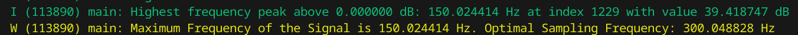

# iot-individual-assignment
Individual Assignment for the Internet-of-Things Algorithms and Services 2023-2024 course at Sapienza

Student: Bernardo PERRONE DE MENEZES BULCAO RIBEIRO (2163025)

## Technical Details

Please note that the app_main function follows the order of the assignment questions, and is not simplified to keep the explanation of the code and results in a report format. For the bonus questions, the assignment is simplified in one function that can be called with different signals.

### 0. Target device

This assignment was completed using a real ESP32 microcontroller. This was chosen due to the fact that MQTT is not supported by IoT-Lab.

### 1. Setup and Initialization of Libraries

The first few lines in the app_main function are used to initialize the libraries that will be used in the assignment, such as:
- NVS partition: Used to store WIFI credentials and MQTT configuration
- WIFI: Using the wifi_connection function to connect to the network. Note that after executing the function, a delay of 10s is added to ensure that the connection is established before proceeding.
- MQTT: Using the mqtt_app_start function to connect to the MQTT broker. The MQTT connection is configured to use TLS with certificates generated locally, in order to ensure a secure connection.
- ESP-DSP FFT tables: dsps_fft2r_init_fc32 is used to initialize the FFT tables used in the assignment.
- INA219: Using the initialize_ina219_library function to initialize and calibrate the INA219 sensor, which is used to measure the current consumption of the ESP32. The library is part of the ESP-IDF-LIB library, which is used to interface with the INA219 sensor.

### 2. Input Signal

For this assignment, I have chosen to use the firmware of the ESP32 to simulate the input signal. It is assumed that the input signal is composed of a sum of two sine waves with different frequencies and amplitudes, as shown in the following equation:

```
signal(t) = 2*sin(2*pi*3*t)+4*sin(2*pi*5*t)
```

For the scope of this assignment, two approaches were considered to simulate the input signal:

1. **Fixed Generation with delays with an initial obtention sampling rate (sample_signal_fixed_with_delay)**: Using a function that takes a fixed length and a sampling rate as input, the signal is generated and sampled. The real-time component is simulated by introducing a delay between the samples and using the time elapsed between samples to calculate the next sample by sampling the sine waves at the desired frequency. This will be used to run the FFT on the signal and identify the optimal sampling frequency, due to the ESP-DSP FFT library requirement of having a buffer aligned to a 16-byte boundary.

2. **Dynamic Generation with delays (sample_signal_dynamic_with_delay)**: Using a function that takes a time window and a sampling rate as input, the signal is generated dynamically and sampled. The real-time component is simulated by introducing a delay between the samples and using the time elapsed between samples to calculate the next sample by sampling the sine waves at the desired frequency. This will be used to compute the aggregate over a time window using a particular sampling rate.

Since the next tasks are measuring the maximum sampling frequency and running FFT on the signal, the first approach is executed in the custom function store_signal(), which is called in the app_main function. This function generates the fixed-length input signal and stores it in memory aligned to a 16-byte boundary. (in the variable "signal") with a sampling frequency of 100Hz, with 4096 samples. It then applies a Hann window to the signal and stores the result in the complex array y_cf. The imaginary part of each element in y_cf is set to zero.

### 3. Maximum sampling frequency:

Identifying the maximum sampling frequency of the device is a task dependent on the way the signal is obtained. For example, if UART is used to receive the signal, the maximum sampling frequency will be limited by the baud rate of the UART connection, or if the ADC is used to sample the signal, the maximum sampling frequency will be limited by the ADC's sampling rate. In this case, since the signal is generated in the firmware and stored in memory, the maximum sampling frequency is limited by the minimum delay that can be generated, which is defined as

```
portTICK_PERIOD_MS = 1 / configTICK_RATE_HZ = 1 / 1000 = 1 ms.
```

Note that the configTICK_RATE_HZ is set to 1000 by configuring CONFIG_FREERTOS_HZ to 1000 using idf.py menuconfig, which allows for a higher sampling rate in the ESP32 for this assignment. This value can be set higher, but it is not recommended to go above 1000 Hz, as it may cause bigger overheads in the CPU and also makes some macros in the ESP-IDF not work properly, such as portTICK_PERIOD_MS.

Therefore, the maximum sampling frequency is 1/1ms = 1000 Hz. This is the maximum sampling frequency that can be achieved by the ESP32 when generating the signal in the firmware and storing it in memory, but not when sampling the signal from an external source like with an ADC.

This is demonstrated in the function measure_max_sampling_signal(), which simulates the sampling process by iterating through the signal data array and counting the number of samples. It calculates the maximum sampling frequency by dividing the total count of samples by the elapsed time (in seconds). This is a simulation which basically determines how fast the ESP32 can sample the signal data if its stored in memory, which is determined by the smallest delay between samples (portTICK_PERIOD_MS) it can produce.


### 4. FFT / Identify optimal sampling frequency

Following the example provided in the official repository https://github.com/espressif/esp-dsp/blob/master/examples/fft/README.md, the power spectrum of the signal is calculated using the FFT, transforming it from the time domain to the frequency domain. After the FFT, the output data is reordered through bit reversal to ensure proper sequence. The complex FFT output is converted into two separate real vectors, allowing for the calculation of the power spectrum. The power spectrum is computed for each frequency component, quantifying the signal's power distribution across frequencies.

After running the program once, we can see that the maximum value of the power spectrum is 41.917538, which is at index 205.
Data max[205] = 41.917538. Since we have 4096 power spectrum components, and the sampling frequency is 100Hz, each component is
100/4096 = 0.0244Hz. The maximum frequency of our signal is 0.0244 * 205 = 5Hz (corresponding to the sinusoid with the highest frequency
in the sum of sinusoids). The optimal sampling frequency is then 10Hz, following the Nyquist theorem. The result of the FFT is shown below:


In order to automate the process of identifying the optimal sampling frequency, the function find_highest_frequency_peak_above_db_level was created. This function takes the power spectrum data, the dB level threshold for identifying peaks, the number of samples in the power spectrum array and the sampling frequency, and returns the frequency of the highest frequency peak above the dB level. The function iterates through the power spectrum data and finds the highest peak above the dB level, returning the frequency of the peak. Note that the power spectrum array follows the logic shown on the paragraph above, where each index corresponds to a frequency component in bins defined by the sampling frequency and the number of samples in the power spectrum array (on this exampleof 100Hz and 4096 samples, each bin is 0.0244Hz). The result can be seen below:


### 5. Compute aggregate function over a window

The aggregate function "compute_aggregate" calculates the average of the sampled signal over a window of 5 seconds, sampling at
10Hz which is the optimal sampling frequency. It only calculates the average for one window of 5 seconds, returning the result, therefore it
works as a "tumbling window" function, where the window is fixed and the function is called every time the window is completed.

For that, the function "sample_signal_dynamic_with_delay" is used to generate the signal dynamically and sample it at 10Hz. This returns
the signal stored in a variable "signal", containing the amount of samples that is possible to generate within 5 seconds at 10Hz. The
aggregate function then calculates the average of the signal over the window of 5 seconds by iterating through the signal array and summing the values, then dividing by the number of samples.

The result of the aggregate function can be seen in the next section, but since the signal is composed of two sinusoids with different
frequencies and amplitudes, the average value tends to be the sum of the averages of the two sinusoids, which is obviously zero, the bigger the time window is (and the more cycles are captured by the sampling process) and this result is observed.

### 6. Communicate the aggregate value to the nearby server:

The aggregate value is communicated to the nearby server using MQTT. The MQTT connection is established in the app_main function, and the aggregate value is published to the topic "/average" in the function publish_data, that takes a data point as an argument and also the QoS level and the topic. The function is called after the aggregate value is calculated in the compute_aggregate function. The MQTT connection is configured to use TLS with certificates generated locally, in order to ensure a secure connection.

For this, a AggregationMessage struct is created to store the average value and the node id, which is then converted to a JSON string using sprintf. The JSON string is then published to the MQTT broker under the topic /average using the mqtt_publish function.

The Edge Server is implemented in Python using the Paho MQTT library. The server subscribes to the /average topic and the /energy topic, parses incoming messages and prints the received messages. The server is run on a personal laptop, and the ESP32 is connected to the same network as the laptop. Also, the MQTT broker is implemented with the Mosquitto MQTT broker, which is running on the same laptop as the Edge Server and is configured to use TLS with certificates generated locally. The configuration for the MQTT Broker can be seen in the mosquitto.conf file inside /edge_server/mqtt_broker, while the edge server is contained in the edge_server.py file inside /edge_server.

Note that the ESP32 is configured to use the LAN IP address of the laptop running the MQTT broker and the edge server is configured to use the "localhost" address in the MQTT configuration (since the edge server runs on the same laptop as the broker). To support both LAN IP and localhost with the TLS certificates, both had to be included as Subject Alternative Names in the server certificate, which is configured using the san.cnf file.

Also, since the TLS certificates are generated locally to run with the LAN network, every change in the network configuration (like changing the network or the IP address) will require the generation of new certificates.

The result of the communication of the aggregate value to the nearby server is shown below:

1. ESP32:


2. Edge Server:


3. MQTT Broker:


### 7. Measure the performance of the system:


#### 7.1. Savings in energy between oversampled and optimal sampling

In order to measure the savings of Energy of the ESP32 using the new adaptive sampling frequency as opposed to the original 100Hz original sampling frequency, the INA219 sensor is used to measure the power consumption of the ESP32. The INA219 sensor is connected to the ESP32 using the I2C protocol in a self-measuring mode, being connected between an external power supply and the ESP32 5V and GND pins (see SETUP.md). The measurements were structured to leverage FreeRTOS tasks since the main task is often blocked due to the signal sampling process. The power_measurement_task runs permanently and is controlled by a global power measurement structure power_measurement_t containing a measuring flag, the start and end time for the current measurement, the number of samples taken, the maximum number of samples and the power sample values.

When the measuring flag is set to true, the task starts measuring the current consumption of the ESP32 using the INA219 sensor. The current consumption is measured every 10ms, and the power consumption is calculated by multiplying the current consumption by the voltage of the ESP32, which is 3.3V, which is done automatically by the ESP-IDF-LIB library. The power consumption is then stored in the power_sample array, and the number of samples is incremented. When the number of samples reaches the maximum number of samples, the measuring flag is set to false, and the task stops measuring the power consumption.

For controlling the procedure, two helper functions start_power_measurement(int max_duration_seconds) and end_power_measurement() were created, the first resetting the global power measurement structure and starting the power measurement task while setting the start time, and the second stopping the power measurement task and processing the power samples to calculate the average power consumption and the energy consumption, returning a power_measurement_result_t structure containing the average power consumption and the energy consumption.

The energy consumption is then calculated for both the oversampled and optimal sampling frequencies 5 times, and the difference between the two is calculated to determine the savings in energy, after which the average savings is calculated per tumblinb window. Note that, although the usage of the INA219 sensor self-measuring the ESP32 introduces an overhead in the energy consumption, since we are interested in the difference between the two sampling frequencies, the overhead is expected to be the same for both cases and can be disregarded.

The results of the energy savings can be seen below:


The energy consumption for the oversampled signal is 0.00392Wh, while the energy consumption for the optimal sampling signal is 0.00380Wh. The savings in energy between the oversampled and optimal sampling signals is 0.00012Wh, or 0.12mWh, and therefore the average savings per tumbling window is 0.12mWh/5 = 0.024mWh. The reduction is only 3.06% in energy consumption, which is expected since we are using a firmware sampling approach and the ESP32 is not doing much overhead processing in the oversampled case (or going to low power modes while waiting for the next sample), and the energy consumption is expected to be similar for both cases. Also, the self-measuring mode of the INA219 sensor introduces an overhead in the energy consumption, which reduces the percentage of savings in energy.

#### 7.2. Volume of data of oversampled against optimal sampling

Due to the implementation choice of using a Tumbling Window, the volume of data of the oversampled signal and the optimal sampled signal is expected to be the same, since the window is fixed and the publish function is called every time the window is completed, always sending the same amount of data (a node id, and the average in JSON format).

This can be seen by running the sampling and publishing functions for both the oversampled and optimal sampling frequencies and comparing the amount of bytes sent in the message for both cases. The results of the volume of data can be seen below. Clearly, each tumbling window sends the same amount of data, regardless of the sampling frequency, which is 53 bytes per tumbling window if the value
is positive, and 54 bytes if the value is negative.


#### 7.3. End-to-end latency of the system.

In order to measure the end-to-end latency of the system, a round-trip approach was adopted making usage of the QoS level 1 of MQTT (only for this last task), which guarantees that the message is delivered at least once. The ESP32 publishes the average value to the /average topic, and the Edge Server subscribes to the /average topic, having to send a PUBACK message to the ESP32 after receiving the message. This is leveraged in the MQTT Handler on the ESP32 to calculate the time it takes from the publication of the message to the reception of the PUBACK message sent by the Edge Server, which is the end-to-end latency of the system multiplied by two (roundtrip). This was repeated 10 times to get an average value of the end-to-end latency, calling the publish_data function with QoS = 1, which can be seen below.


Since the total time for the publish and receive of the PUBACK message for 10 times is 136276 microseconds, the average roundtrip  latency is 13627.6 microseconds, and the average one-way end-to-end latency is 6813.8 microseconds, or 6.81ms.

Note that the small latency is expected since the ESP32 and the Edge Server are connected to the same LAN network, and the MQTT broker is running on the same laptop as the Edge Server. 

### 8. Bonus

For the bonus task, 3 different input signals were considered and a performance analysis was held using energy savings measurements for the oversampled and original sampling rate. Note that it does not make sense to measure the Latency since it is calculated as the time between Publish and PUBACK and it wouldn't change with different signals, and neither the Volume of Data because of the Tumbling Window technique adopted here. Also, the original sampling rate was raised to be 500Hz in this case.

The signals were:

#### 8.1. Signal 1: 2*sin(2*pi*3*t)+4*sin(2*pi*5*t) (Original Signal)

For the first signal, as seen previously the maximum frequency is 5Hz and the optimal sampling rate is 10Hz:


The results in Energy Savings between an oversampled and optimal sampling rate can be seen below:


On this case, the energy consumption for the oversampled signal is 0.00390Wh, while the energy consumption for the optimal sampling signal is 0.00386Wh. The savings in energy between the oversampled and optimal sampling signals is 0.00004Wh, or 0.04mWh, and therefore the average savings per tumbling window is 0.04mWh/5 = 0.008mWh. The reduction is only 1.03% in energy consumption.

#### 8.2. Signal 2: 1*sin(2*pi*2*t) + 2*sin(2*pi*20*t) + 3*sin(2*pi*100*t)

For the second signal, the maximum frequency is 100Hz and the optimal sampling rate is 200Hz:


The results in Energy Savings between an oversampled and optimal sampling rate can be seen below:


On this case, the energy consumption for the oversampled signal is 0.00393Wh, while the energy consumption for the optimal sampling signal is 0.00386Wh. The savings in energy between the oversampled and optimal sampling signals is 0.00007Wh, or 0.07mWh, and therefore the average savings per tumbling window is 0.07mWh/5 = 0.014mWh. The reduction is only 1.78% in energy consumption.

#### 8.3. Signal 3: 3sin(2*pi*150*t)

For the third signal, the maximum frequency is 150Hz and the optimal sampling rate is 300Hz:


The results in Energy Savings between an oversampled and optimal sampling rate can be seen below:


On this case, the energy consumption for the oversampled signal is 0.00390Wh, while the energy consumption for the optimal sampling signal is 0.00349Wh. The savings in energy between the oversampled and optimal sampling signals is 0.00041Wh, or 0.41mWh, and therefore the average savings per tumbling window is 0.41mWh/5 = 0.082mWh. The reduction is 10.51% in energy consumption.

#### 8.4. Impact on overall performance in the case of adaptive sampling vs basic/over-sampling for different signals

The results show unsignificant energy savings and quite inconsistent results for the different signals, with the third signal showing the biggest savings in energy. This is unexpected since the adaptive sampling rate for the third signal is the closest to the original oversampled rate, and the savings in energy should be smaller. This is due to the fact that the ESP32 is not doing much overhead processing in the oversampled case (or going to low power modes while waiting for the next sample), and the energy consumption is expected to be similar for all cases.

In conclusion, due to the design choice of using a firmware sampling approach and the ESP32 not doing much overhead processing in the oversampled case, the impact on overall performance in the case of adaptive sampling vs basic/over-sampling for different signals is unsignificant, with the energy savings being quite inconsistent and not showing a clear pattern, which is not the case for real-life applications where the ESP32 would be using an ADC to sample the signal, and the energy savings would be more significant and directly related to the reduction in the sampling frequency by adjusting it to the optimal sampling frequency. The expected result would then be bigger savings for signals with lower maximum frequencies, and smaller savings for signals with higher maximum frequencies.

## Hands-On Walkthrough of the System and Setup

For a detailed walkthrough of the system and setup, please refer to the Setup.md file.